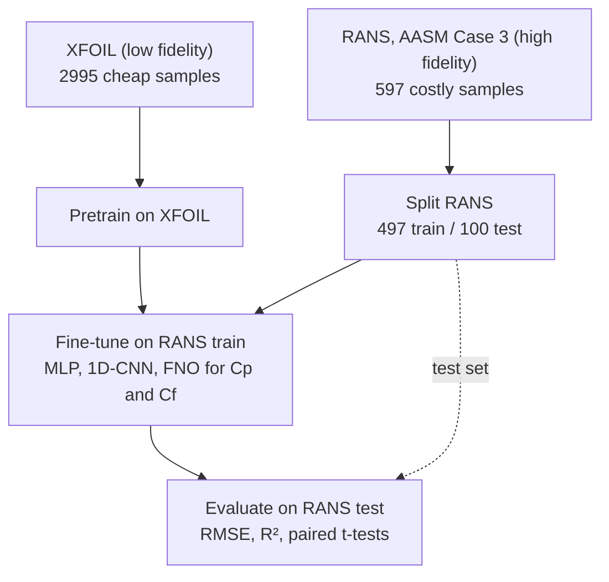
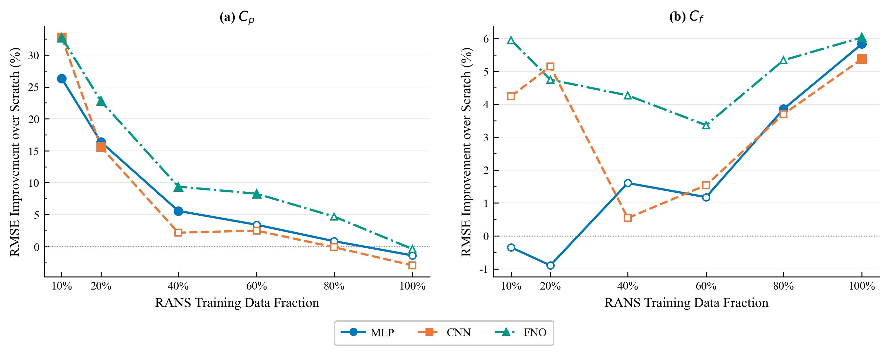

# Multi-Fidelity Transfer Learning for Airfoil Surface Distribution Prediction on the AASM Benchmark

Code, data, and results for the paper accepted at the AIAA SciTech Forum.

The idea: a neural surrogate for RANS surface distributions is expensive to train because every RANS sample costs a CFD run. XFOIL samples cost almost nothing. We pretrain on thousands of XFOIL solutions, then fine-tune on the few hundred RANS samples from AASM Case 3, and ask whether the cheap data helps. It does, and it helps most when RANS data is scarce.

Three architectures (MLP, 1D-CNN, FNO), two targets (pressure coefficient Cp and skin friction coefficient Cf), and three training regimes each:

| Model | Training | What it tests |
|---|---|---|
| A | XFOIL only, evaluated on RANS | how far the low-fidelity solver is from RANS on its own |
| B | RANS from scratch | the baseline surrogate |
| C | pretrain on XFOIL, fine-tune on RANS | transfer learning |

A data-budget study repeats B and C at 10%, 20%, 40%, 60%, 80%, and 100% of the RANS training set, five seeds each, with a paired t-test at every fraction.

## Pipeline



Inputs are the 12 AASM Case 3 parameters: Mach, angle of attack, Reynolds number, and CST shape coefficients on the RAE2822 base airfoil. Outputs are 512-point surface distributions (256 upper, 256 lower).

## Results

Mean over five seeds on the RANS test set, full RANS training budget.

| Target | Model | MLP RMSE | MLP R² | CNN RMSE | CNN R² | FNO RMSE | FNO R² |
|---|---|---|---|---|---|---|---|
| Cp | A (XFOIL only) | 0.1027 | 0.920 | 0.1129 | 0.903 | 0.1001 | 0.924 |
| Cp | B (scratch) | 0.0568 | 0.976 | 0.0590 | 0.974 | 0.0564 | 0.976 |
| Cp | C (transfer) | 0.0554 | 0.977 | 0.0574 | 0.975 | 0.0551 | 0.977 |
| Cf | A (XFOIL only) | 0.0028 | -0.79 | 0.0028 | -0.81 | 0.0028 | -0.80 |
| Cf | B (scratch) | 0.0010 | 0.784 | 0.0010 | 0.767 | 0.0011 | 0.734 |
| Cf | C (transfer) | 0.0010 | 0.793 | 0.0010 | 0.779 | 0.0010 | 0.777 |

The gain from transfer grows as RANS data shrinks. At 10% of the RANS training set, transfer cuts Cp RMSE by roughly a quarter to a third depending on architecture.



Full numbers, including per-seed values, p-values, and effect sizes for every budget fraction, are in `Results/`.

## Repository layout

```
Data/       xfoil_gen.py (XFOIL dataset generation), process_case3_data.py (AASM RANS parsing), the three .npz datasets
Models/     one folder per architecture (MLP, 1D-CNN, FNO), each split into Pressure/ and Friction/
            cp_model_a.py, cp_model_b.py, cp_model_c.py   the three regimes for Cp (same for cf_*)
            cp_budget_exp.py                              the data-budget study
Results/    final_results_{mlp,cnn,fno}.json (paper numbers), per-run JSON files, significance_test.py
Figures/    plotting scripts and the figures and table used in the paper
```

## Running it

```bash
pip install -r requirements.txt
```

The datasets are included, so the model scripts run as-is from anywhere:

```bash
python Models/FNO/Pressure/cp_model_c.py
python Models/MLP/Friction/cf_budget_exp.py
```

Each script writes its JSON results into `Results/`. The FNO scripts need the `neuraloperator` package; the MLP and CNN scripts only need PyTorch.

To regenerate the datasets you need XFOIL and the raw AASM Case 3 download:

```bash
export XFOIL_EXE=/path/to/xfoil
export AASM_TRAIN_PATH=/path/to/case3/trainingData
export AASM_TEST_PATH=/path/to/case3/testData
python Data/xfoil_gen.py
python Data/process_case3_data.py
```

The two XFOIL-vs-RANS comparison figures also call XFOIL and read `XFOIL_EXE`. Everything else in `Figures/` runs from the JSON files in `Results/`.

## Data

RANS data is AASM Benchmark Case 3 (Bekemeyer et al., 2025): 497 training and 100 test samples. The XFOIL dataset is generated with `Data/xfoil_gen.py` over the same parameter bounds: 3000 runs, of which 2995 converged and are kept.

## Citation

Paper accepted at the AIAA SciTech Forum. Citation details will be added once the proceedings are published.
